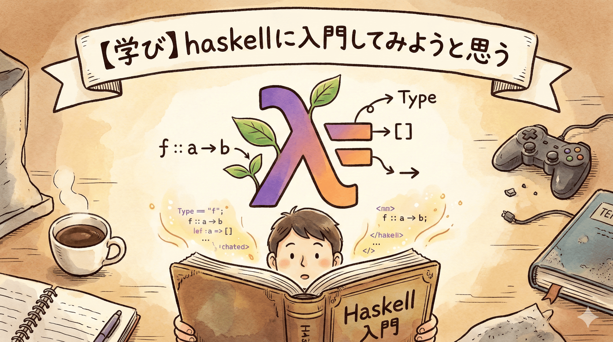

私は大学にて計算機科学を勉強している、学部3年生（2026/02/08、現在）の者です。

弊学では、ちょうど1月の最終週あたりから春休み（外では雪が降っているが）が始まっていて、せっかくの春休みだし*何かしよう*と思い、haskellを勉強しようと思いました。

今の所、ちょうど15時間ぐらい時間を投下していたので、日記ぐらいの気持ちでここに書き留めておきたいと思います。

## なぜ、私はHaskellを学ぶのか

卒業後はIT業界で働いていくことが決まっているのですが、就活を終えるまでにちょうど1年半ほど`プログラミング`やら`web開発`やらを独学していました。[^1]

正直に言ってプログラミングやweb開発を独学した理由は、自分自身が満足できる程度の金額を稼ぎたかったからという点は少なからずあります。[^2]

しかし、最近は就活を終え憑き物が落ちたように **「キャリアのための学習」** ができなくなりました、仕事を始めたら仕事に必要な学習を習得すると思うのですが、どうしても将来のキャリアを逆算して学習をするというのは自身の性格の特性上難しい[^3]と感じました。

そこで、色々なものに手を出してみたのですが、`Haskell`というプログラミング言語に出会い学習を始めました、私は大抵のことは1時間もしないで飽きるのですが、今の所は学習を続けられているので、ある程度向いているのかなと思います。[^4]

## Haskellを学んだ後の展望

15 ~ 16時間程度を勉強してなんとなくですが、既存の開発にどのように活かせるかどうかはわかってきました。

おそらくですが、現代の開発をいう文脈だと「人間の認知負荷を減らす」という文脈でhaskellを学習する意味や意義はあると考えています。

現代の開発は`Claude Code`や`Codex`等のターミナル上で開発を支援する、AIエージェントの台頭で、「AIに指示をすると大量のコードが一度に吐き出される」という状況だと推察しています、結果的に開発スピードは劇的に上がったのですが、ソースコードを読み処理を理解するというのは、かなりの負荷があり人間を支援するはずのAIが人間をぶっ壊しているという、皮肉めいた状態だと思っています。

従来の手続き型のプログラミング言語は書かれたソースコードを1行ずつ実行し、多くのソースコードを合成することで一つの機能を実装するわけですが、`Haskell`は式を書き「それは何者であるか」を記述し、多くの式を扱うことで一つの機能を実現します。

上の例えは抽象度が高くわかりづらいですが、`Haskell`のように式として書くことで「かなり読みやすく」なる感覚を得ています。

`OOP`ではオブジェクトを`interface`と分離して抽象度をあげることで、「それが何者であるか」を実装と切り分けて表現してしていました、これを仮に「ボトムアップ式の抽象分離」と言わせていただくと、`Haskell`ではソースコードの1つの塊で「それが何者であるか」を表現しており、1つの塊の中で複雑な部分は細分化され、その細分化の中で「それが何者であるか」を表現しています、先述したものと対比して「トップダウン式の抽象分離」と私は解釈しています。

「トップダウン式の抽象分離」は比較的に人間にとって読みやすいものだと私は考えています、どうやらプログラミングパラダイムとして`FP`だとか言われているみたいですが、私は理解できていないので、この記事ではまだ[^5]FPという言葉を使わないでおきます。

### まとめると

かなり読みにくい文章になってしまいましたが、まとめると「`Haskell`を学ぶことで人にとって理解しやすい表現ができる」ようになると考えています。

## 学習教材

私が学習に使っている（or 使っていた）教材を記しておきます、随時更新予定です。

### [2013 Spring]Cis194 Introduction to Haskell by University of Pennsylvania

ペンシルベニア大学の授業です、これで勉強し始めました。

[この教材のリンク](https://www.cis.upenn.edu/~cis1940/spring13/)

英語で書いてあるので、日本語で勉強したい方はお好みのAI（`Gemini`,`ChatGPT`）で翻訳させてしまうのがおすすめです。`DeepL`,`Google`翻訳だと厳しいなと感じる箇所があります。

homeworkの回答は有志で公開されている方がいらっしゃるので検索されると良いかと思います。

### Learn You a Haskell for Great Good!

[この教材のリンク](https://learnyouahaskell.github.io/)

副教材として扱っています、`Cis194`でわからなかったこと、こちらの教材で調べています。

[^1]: 中学生の頃に簡単なpythonを書いたことはあるので、きっかり1年半ではないですが...

[^2]: 勿論、他にもたくさん理由はあります、就活では別の理由を話しました。

[^3]: テスト一週間前から勉強するタイプです、「不透明な未来のために」なんて、相当に切羽詰まっていなきゃできません

[^4]: あまり深く理解せずにやっているとAIのコンテキスト許容量を超えた際に発生するバグに対応できない気がしているんですよね、ここら辺は議論が生まれそうですが.....

[^5]: 2026/02/08
